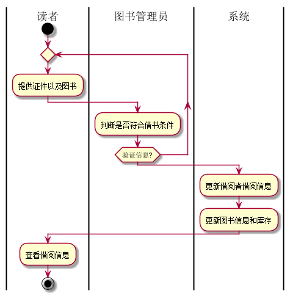

# 实验二：图书管理系统用例建模
### 姓名：曾玉龙
### 班级：15软工2班
### 学号：201510414202


- - -
# 实验二：图书管理系统用例建模
## 1.图书管理系统的用例关系图
### 1.1用例图PlantUML源码如下：
    @startuml
    skinparam packageStyle rectangle

    :Admin: as Administor
    :Librarian: as Librarian
    :Borrower: as Borrower


    rectangle  {
    	left to right direction
    	Librarian --> (维护图书)
    	Librarian --> (借出图书)
    	Librarian --> (还原图书)
    	Librarian --> (维护借阅信息)

    	Administor --> (维护图书管理员信息)
        Administor --> (维护图书信息)
        Administor -> (维护借阅者信息)

    	Borrower --> (查询图书)
        Borrower -> (借阅图书)
        Borrower -> (还书)
        Borrower -> (缴纳罚金)
    	Borrower --> (查询借阅信息)


    	(借出图书) .> (还原图书) : extends
        (借阅图书) .> (还书) : extends
        (借阅图书) .> (查询借阅信息) : extends
        (还书) .> (缴纳罚金) : extends
    	(借出图书) .> (维护图书) : include
    	(还原图书) .> (维护图书) : include


    }
    @enduml
### 1.2用例图如下：


## 2.参与者说明
### 2.1 系统管理员（Administor）
主要职责是：
- 维护图书信息，包括图书的添加、删除和修改，书目的添加和删除；
- 维护借阅者信息，包括借阅者增加，删除，修改等信息；
- 维护图书管理员信息，包括图书管理员增加，删除，修改等信息。
### 2.2 图书管理员（Librarian）
主要职责是：
- 对借阅者的借书、还书等操作进行处理。
- 还书时若借阅者逾期，毁坏图书等收取罚金。
### 2.3 借阅者
主要职责是：
- 可以通过查询图书；
- 可查询个人的借阅情况；
- 可以节约图书，并按要求归还图书；
- 如果不按要求归还等等需缴纳罚金。
## 3.用例规约表
### 3.1 "借出图书"用例
|Title | 内容 |
|:------:|:------:|
|用例名称|借出图书|
|参与者|图书管理员（主要参与者）、借阅者（次要参与者）|
|前置条件|图书管理员确认借阅者所节约的图书信息|
|后置条件|更新图书库存，图书借阅信息更新，借阅者借阅信息更新|
|主事件流|1.借阅者提供相应证件；<br>2.系统验证借阅者身份和图书信息；<br>3.图书管理员将借阅者信息和图书录入系统；<br>4.系统更新借阅者和图书信息；<br>5系统累加读者的借书数量；<br>6.重复3~5，直到图书管理员确认全部图书登记完毕；<br>7.系统打印借书清单，借书完成|

### 3.2 "归还图书"用例
 |Title | 内容 |
 |:------:|:------:|
 |用例名称|还原图书|
 |参与者|图书管理员（主要参与者）、借阅者（次要参与者）|
 |前置条件|图书管理员确认借阅者所节约的图书信息|
 |后置条件|更新图书库存，图书借阅信息更新，借阅者借阅信息更新|
 |主事件流|1.借阅者提供所借图书；<br>2.系统验证图书是否逾期，图书管理员验证图书是否损坏；<br>3.图书管理员将符合还书条件的图书的信息录入系统；<br>4.更新图书信息和借阅者信息；<br>5.系统记录还书信息，并且修改图书的状态和此书的可借数量；<br>6.系统打印还书清单，还书完成|
 |备注|还书须由图书管理员完成|

### 3.3“借出图书”用例流程图源码如下：
 ```
@startuml
|读者|
start
repeat
:提供证件以及图书;
	|图书管理员|
	:判断是否符合借书条件;
repeat while (验证信息?)
|系统|
:更新借阅者借阅信息;
:更新图书信息和库存;
|读者|
:查看借阅信息;

stop
@enduml
 ```
### 3.3.1“借出图书”用例流程图如下：


### 3.4“归还图书”用例流程图源码如下：
 ```
@startuml
|读者|
start
:提供证件以及图书;
	|图书管理员|
	:判断是否符合还书条件;
if (验证是否符合约定?) then (yes)
  :顺利还书;
else (no)
  :还书并缴纳罚金;
endif
|系统|
:更新借阅者借阅信息;
:更新图书信息和库存;
|读者|
:查看借阅信息;

stop
@enduml
 ```
### 3.4.1“归还图书”用例流程图如下：

