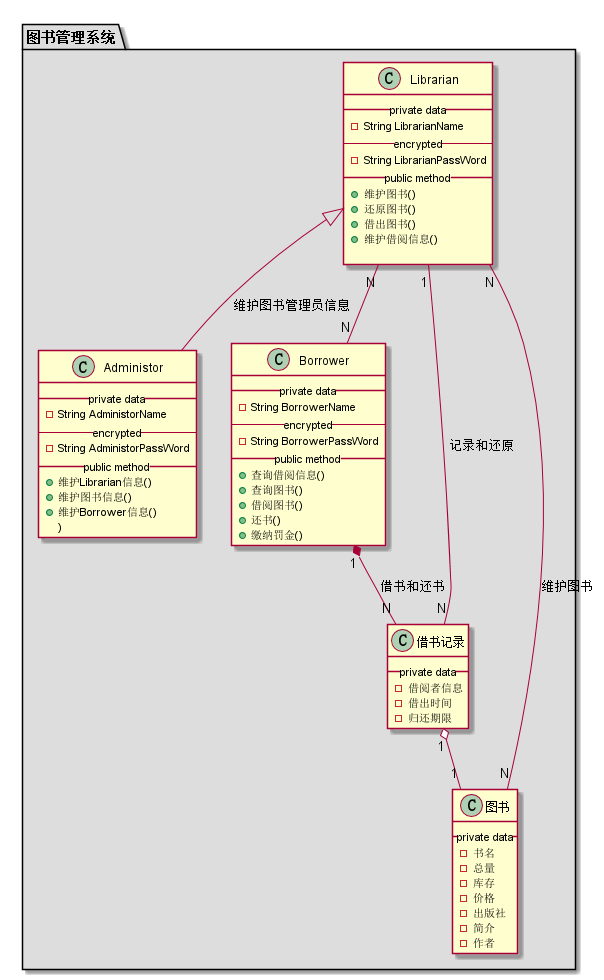
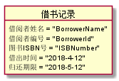

## 实验三：图书管理系统领域对象建模

|学号|班级|姓名|
|:---------------:|:------------:|:------------:|
|201510511202|软件15-2|曾玉龙|

### 1.图书管理系统类图

**1.1PlantUML源码如下：**
~~~
@startuml

package "图书管理系统" #DDDDDD {

	class Librarian {
		 __ private data __
	 	-String username
	 	-- encrypted --
	 	-String password
		 __ public method __
		+维护图书()
		+还原图书()
		+借出图书()
		+维护借阅信息()

	}
	class Administor {
		 __ private data __
	 	-String username
	 	-- encrypted --
	 	-String password
		 __ public method __
	 	+维护Librarian信息()
	 	+维护图书信息()
	 	+维护Borrower信息()
	)
	}
	class Borrower {
	 	__ private data __
	 	-String username
	 	-- encrypted --
	 	-String password
		 __ public method __
		+查询借阅信息()
		+查询图书()
		+借阅图书()
		+还书()
		+缴纳罚金()
	}

	class 图书 {
		__ private data __
	 	-书名
	 	-总量
	 	-库存
	 	-价格
	 	-出版社
	 	-简介
	 	-作者
	}

	class 借书记录 {
		__ private data __
	 	-借阅者信息
	 	-借出时间
	 	-归还期限
	}

	Librarian <|-- Administor : 维护图书管理员信息
	Borrower "1" *-- "N" 借书记录 : 借书和还书
	借书记录 "1" o-- "1" 图书
	借书记录 "N" -- "1" Librarian : 记录和还原
	Librarian "N" --- "N" 图书 : 维护图书
	Librarian "N" -- "N" Borrower

}

@enduml
~~~
**1.2图书管理系统类图如下：**

### 2.图书管理系统对象图

**2.1类图书对象图**

**2.1.1PlantUML源码如下：**
~~~
@startuml

object 图书 {
	 	书名 = "bookname"
	 	ISBN号 = "ISBNumber"
	 	总量 = "Allbooknumber"
	 	库存 = "booknumber"
	 	价格 = "price"
	 	出版社 = "Press"
	 	简介 = "Book Introduction"
	 	作者 = "author"
}
@enduml
~~~

**2.1.2对象图如下：**

**2.2类图书管理系统角色对象图**

**2.2.1PlantUML源码如下：**
~~~
@startuml

object Librarian {
		 username = "LibrarianName"
		 userid = "LibrarianId"
		 password = "LibrarianPassWord"
}
object Administor {
		 username = "AdministorName"
		 password = "AdministorPassWord"

}

object Borrower {
	 	username = "BorrowerName"
	 	userid = "BorrowerId"
		password = "BorrowerPassWord"
}
@enduml
~~~

**2.2.2对象图如下：**

**2.3类借书记录对象图**

**2.3.1PlantUML源码如下：**
~~~
@startuml

object 借书记录 {
	 	借阅者姓名 = "BorrowerName"
	 	借阅者编号 = "BorrowerId"
	 	图书ISBN号 = "ISBNumber"
	 	借出时间 = "2018-4-12"
	 	归还期限 = "2018-5-12"
}

@enduml
~~~

**2.3.2对象图如下：**

