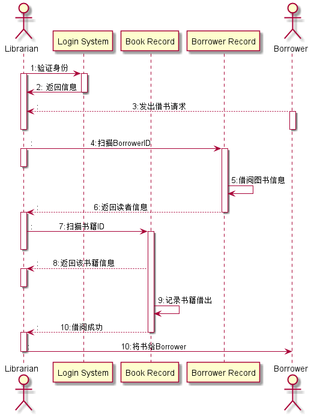
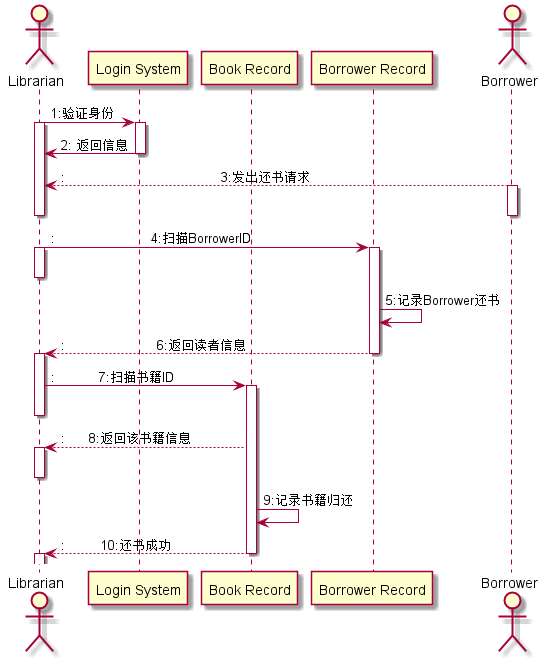
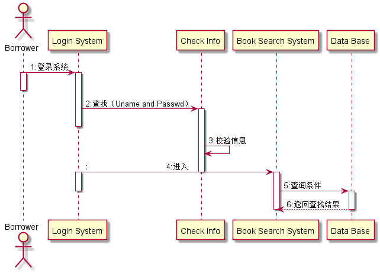
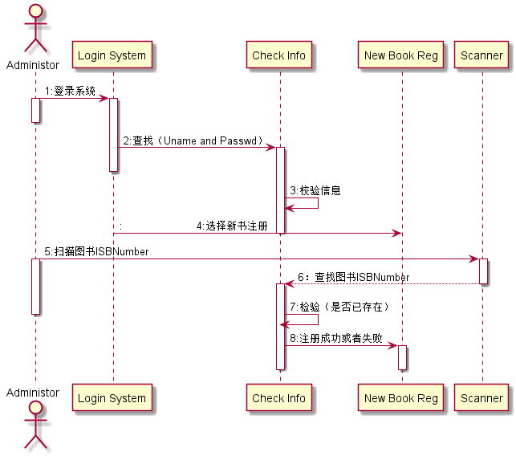
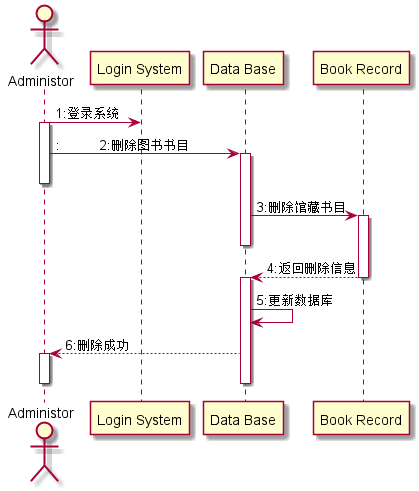
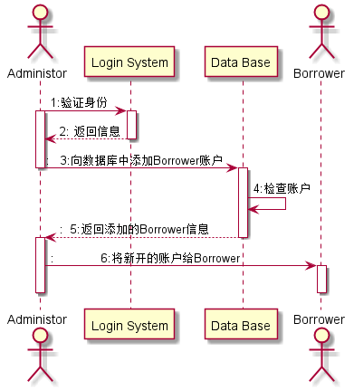
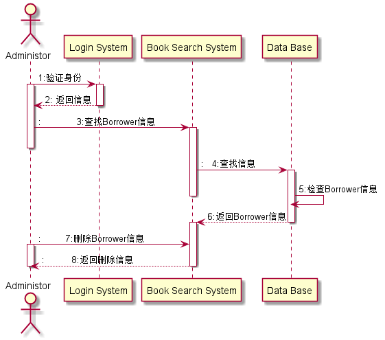
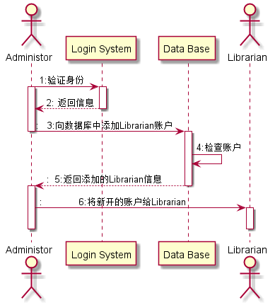

<<<<<<< HEAD
## 实验四：图书管理系统顺序图绘制

|学号|班级|姓名|
|:---------------:|:------------:|:------------:|
|201510414202|软件15-2|曾玉龙|

### 1.图书管理系统借书时序图
**1.1PlantUML源码如下：**
~~~
@startuml
actor Librarian
participant "Login System" as A
participant "Book Record" as B
participant "Borrower Record" as C
actor "Borrower" as D

Librarian -> A: 1:验证身份
activate Librarian
activate A
A->Librarian: 2: 返回信息
deactivate A

D -->Librarian::                                       3:发出借书请求
activate D
deactivate D
deactivate Librarian
Librarian -> C::                        4:扫描BorrowerID
activate Librarian
deactivate Librarian
activate C
C->C:5:借阅图书信息
C -->Librarian::                       6:返回读者信息
deactivate C
activate Librarian
Librarian -> B::           7:扫描书籍ID
activate B
deactivate Librarian
B-->Librarian::      8:返回该书籍信息

activate Librarian
deactivate Librarian

B->B:9:记录书籍借出
B-->Librarian::         10:借阅成功
deactivate B

activate Librarian
Librarian ->D::                                      10:将书给Borrower
deactivate Librarian

@enduml
~~~
**1.2图书管理系统借书时序图如下：**

### 2.图书管理系统还书时序图
**2.1PlantUML源码如下：**
~~~
@startuml
actor Librarian
participant "Login System" as A
participant "Book Record" as B
participant "Borrower Record" as C
actor "Borrower" as D

Librarian -> A: 1:验证身份
activate Librarian
activate A
A->Librarian: 2: 返回信息
deactivate A

D -->Librarian::                                       3:发出还书请求
activate D
deactivate D
deactivate Librarian
Librarian -> C::                        4:扫描BorrowerID
activate Librarian
deactivate Librarian
activate C
C->C:5:记录Borrower还书
C -->Librarian::                       6:返回读者信息
deactivate C
activate Librarian
Librarian -> B::           7:扫描书籍ID
activate B
deactivate Librarian
B-->Librarian::      8:返回该书籍信息

activate Librarian
deactivate Librarian

B->B:9:记录书籍归还

B-->Librarian::         10:还书成功

deactivate B
activate Librarian
deactivate Librarian
@enduml
~~~

**2.2图书管理系统还书时序图如下：**

### 3.图书管理系统查书时序图
**3.1PlantUML源码如下：**
~~~
@startuml
actor Borrower
participant "Login System" as A
participant "Check Info" as B
participant "Book Search System" as C
participant "Data Base" as D

Borrower->A:1:登录系统
activate Borrower
activate A
deactivate Borrower

A->B:2:查找（Uname and Passwd）
activate B
deactivate A
B->B:3:校验信息

A->C::                                 4:进入
deactivate B
activate A
activate C

C->D:5:查询条件
deactivate A
activate D
D-->C:6:返回查找结果
deactivate D
deactivate C
@enduml
~~~

**3.1图书管理系统查书时序图如下：**

### 4.系统管理员对书的操作
#### 4.1注册新书
**4.1.1PlantUML源码如下：**
~~~
@startuml
actor Administor
participant "Login System" as A
participant "Check Info" as B
participant "New Book Reg" as C
participant "Scanner" as D

Administor->A:1:登录系统
activate Administor
activate A
deactivate Administor

A->B:2:查找（Uname and Passwd）
activate B
deactivate A
B->B:3:校验信息
A->C::                       4:选择新书注册

deactivate B
Administor->D:5:扫描图书ISBNumber
activate  Administor
activate D
D-->B:6：查找图书ISBNumber
deactivate D
activate B
B->B:7:检验（是否已存在）
deactivate Administor
B->C:8:注册成功或者失败
activate C
deactivate C
deactivate B
@enduml
~~~
**4.1.1注册新书时序图如下：**

#### 4.2删除图书
**4.2.1PlantUML源码如下：**
~~~
@startuml

actor Administor
participant "Login System" as A
participant "Data Base" as B
participant "Book Record" as C

Administor->A:1:登录系统
activate Administor

Administor->B::          2:删除图书书目
activate B
deactivate Administor

B->C:3:删除馆藏书目
activate C
deactivate B
C-->B:4:返回删除信息
deactivate C
activate B
B->B:5:更新数据库

B-->Administor:6:删除成功
activate Administor
deactivate B
deactivate Administor
@enduml
~~~
**4.2.2删除图书时序图如下：**

### 5.系统管理员对Borrower的操作
#### 5.1添加Borrower
**5.1.1PlantUML源码如下：**
~~~
@startuml
actor Administor
participant "Login System" as A
participant "Data Base" as B
actor "Borrower" as C
Administor-> A: 1:验证身份
activate Administor
activate A
A-->Administor: 2: 返回信息
deactivate A

Administor->B::   3:向数据库中添加Borrower账户
deactivate Administor
activate B
B->B:4:检查账户
B-->Administor::  5:返回添加的Borrower信息
deactivate B
activate Administor
Administor->C::             6:将新开的账户给Borrower

activate C
deactivate Administor
deactivate C
@enduml
~~~
**5.1.2添加Borrower时序图如下：**

#### 5.2删除Borrower
**5.2.1PlantUML源码如下：**
~~~
@startuml
actor Administor
participant "Login System" as A
participant "Book Search System" as B
participant "Data Base" as C

Administor-> A: 1:验证身份
activate Administor
activate A
A-->Administor: 2: 返回信息
deactivate A

Administor->B::             3:查找Borrower信息
activate B
deactivate Administor
B->C::   4:查找信息
activate C
C->C:5:检查Borrower信息
deactivate B
C-->B:6:返回Borrower信息
deactivate C
activate B

Administor->B::         7:删除Borrower信息
activate Administor
B-->Administor::          8:返回删除信息
deactivate B
deactivate Administor

@enduml
~~~
**5.2.2删除Borrower时序图如下：**

### 6.系统管理员对Librarian的操作
#### 6.1添加Librarian
**6.1.1PlantUML源码如下：**
~~~
@startuml
actor Administor
participant "Login System" as A
participant "Data Base" as B
actor "Librarian" as C
Administor-> A: 1:验证身份
activate Administor
activate A
A-->Administor: 2: 返回信息
deactivate A

Administor->B::   3:向数据库中添加Librarian账户
deactivate Administor
activate B
B->B:4:检查账户
B-->Administor::  5:返回添加的Librarian信息
deactivate B
activate Administor
Administor->C::             6:将新开的账户给Librarian

activate C
deactivate Administor
deactivate C
@enduml
~~~

**6.1.2添加Librarian时序图如下：**

#### 6.2删除Librarian
**6.2.1PlantUML源码如下：**
~~~
@startuml
actor Administor
participant "Login System" as A
participant "Book Search System" as B
participant "Data Base" as C

Administor-> A: 1:验证身份
activate Administor
activate A
A-->Administor: 2: 返回信息
deactivate A

Administor->B::             3:查找Librarian信息
activate B
deactivate Administor
B->C::   4:查找信息
activate C
C->C:5:检查Librarian信息
deactivate B
C-->B:6:返回Librarian信息
deactivate C
activate B

Administor->B::         7:删除Librarian信息
activate Administor
B-->Administor::          8:返回删除信息
deactivate B
deactivate Administor
@enduml
~~~
**6.2.2删除Librarian时序图如下：**

=======
