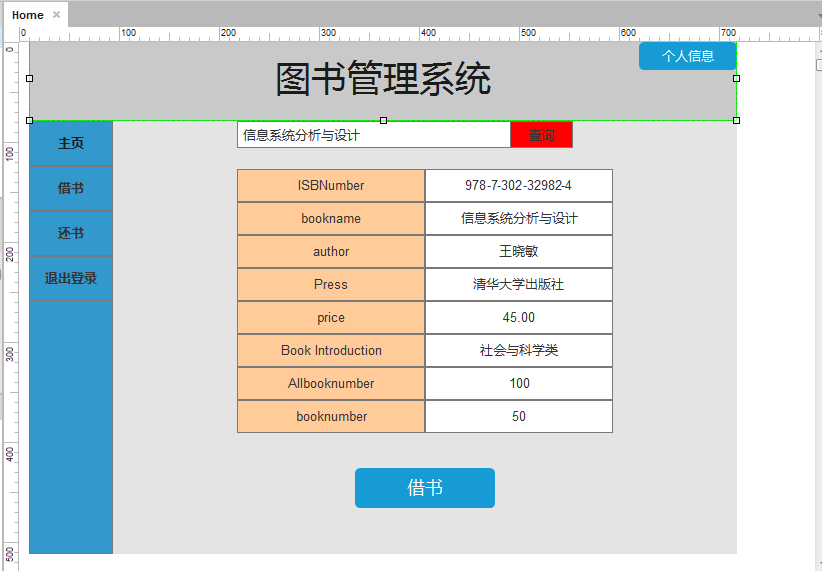

# 实验5 图书管理系统数据库设计与界面设计

|学号|班级|姓名|
|:---------------:|:------------:|:------------:|
|201510414202|软件15-2|曾玉龙|

***
### ====== 以下为本次作业 ======
- - -
# 实验5 图书管理系统数据库设计与界面设计
## 1.数据库表设计
### 1.1 Book表：

|字段 |类型 |主键，外键 |可以为空 |默认值|约束|说明|
|:-------:|:-------------:|:------:|:----:|:---:|:----:|:-----|
|ISBNumber|varchar(100)|主键    |否| | | |
|bookname|varchar(100)|   |否| | | |
|author|varchar(100)|    |否|  |  |  |  
|Press|varchar(100)|  |否| | | |
|price|varchar(100)|  |否| | | |
|Book Introduction|varchar(100)|   |是|  |  |  |  
|Allbooknumber|int|  |否| | | |
|booknumber|int|   |是|  |  |  |   

### 1.2 Borrower表：

|字段 |类型 |主键，外键 |可以为空 |默认值|约束|说明|
|:-------:|:-------------:|:------:|:----:|:---:|:----:|:-----|
|BorrowerId|varchar(20)|主键    |否| | | |
|BorrowerName|varchar(100)|     否   |否| | | |
|BorrowerPassWord|varchar(100)|  否  |否|  |  |  |  

### 1.3 Librarian表：

|字段 |类型 |主键，外键 |可以为空 |默认值|约束|说明|
|:-------:|:-------------:|:------:|:----:|:---:|:----:|:-----|
|LibrarianId|varchar(20)|主键    |否| | | |
|LibrarianName|varchar(100)|     否   |否| | | |
|LibrarianPassWord|varchar(100)|     否   |否| | | |

### 1.4 Administor表：

|字段 |类型 |主键，外键 |可以为空 |默认值|约束|说明|
|:-------:|:-------------:|:------:|:----:|:---:|:----:|:-----|
|AdministorName|varchar(100)|主键    |否| | | |
|AdministorPassWord|varchar(100)|     否   |否| | | |

### 1.5 借阅记录表：

|字段 |类型 |主键，外键 |可以为空 |默认值|约束|说明|
|:-------:|:-------------:|:------:|:----:|:---:|:----:|:-----|
|BorrowerId|varchar(20)|主键    |否| | | |
|BorrowerName|varchar(100)|  否 |否|  |  |  |  
|ISBNumber|varchar(100)|  否 |否|  |  |  | 
|借出时间|datatime|  否 |否|  |  |  | 
|归还期限|varchar(100)|  否 |否|  |  |  | 

## 2. 界面设计
## 2.1. 借书界面设计

  

- 用例图参见：借书用例
- 类图参见：书目类,借书类
- 顺序图参见：借书顺序图
- API接口如下：  

1.查询图书API
- 功能：用于获取图书所有信息
- 请求地址： http://localhost:8080/LibrarySystem/api/selectBook
- 请求方法：POST
- 请求参数：

|参数名称|必填|说明|
|:-------:|:-------------: | :----------:|
|ISBNumber|是|用于查询制定图书的全部信息,以隐藏域的方式传递 |
|method|是|固定为 “post”。|

- 返回实例：
```
{
    "info": "查询成功,返回信息",
    "data": {
        "ISBNumber": "978-7-302-32982-4",
        "bookname": "信息系统分析与设计",
        "author": "王晓敏",
        "Press": "清华大学出版社",
        "price": "45.00",
        "Book Introduction": "社会与科学类",
        "Allbooknumber": "100",
        "booknumber": "50",
        },
    "code": 200
}
```
- 返回参数说明：
    
|参数名称|说明|
|:-------:|:-------------: |
|Info|返回信息|
|data|返回的图书信息|
|dodo|返回码|

2.借书API
- 功能：用于借书操作
- 请求地址： http://localhost:8080/LibrarySystem/api/lendBook
- 请求方法：POST
- 请求参数：

|参数名称|必填|说明|
|:-------:|:-------------: | :----------:|
|BorrowerId|是|读者信息表主键 |
|method|是|固定为 “post”。|

- 返回实例：
```
{
    "info": "借阅成功",
    "data": {
        "result": "借阅成功",
        },
    "code": 200
}
```
- 返回参数说明：
    
|参数名称|说明|
|:-------:|:-------------: |
|Info|返回信息|
|data|返回的结果信息|
|dodo|返回码|