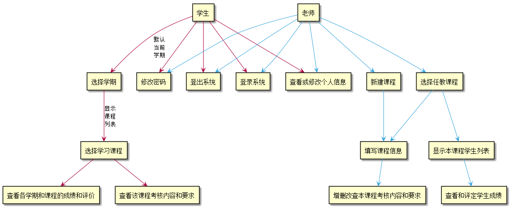
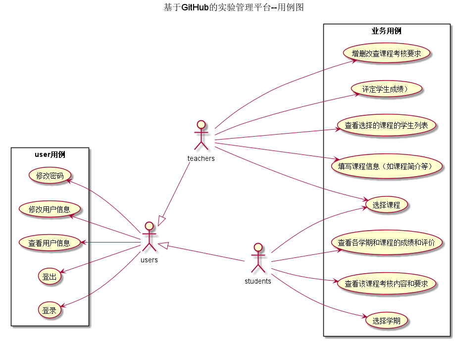
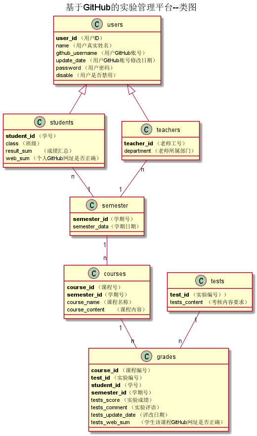

# 基于GitHub的实验管理平台的设计与分析

#

|学号|班级|姓名|照片|
|:-------:|:-------------: | :----------:|:---:|
|201510414202|软工15-2|曾玉龙|暂无|

## 1. 概述
*   基于GitHub的学生成绩管理系统（以下简称本系统），主要功能对于老师是提供评定学生本课程成绩；  
对于学生是查看学生本人各个学期各个课程成绩。本系统用户分为老师和学生。系统用户都有对个人信息
修改的权限，如（GITHUB链接）。  
    
## 2. 系统总体结构
*   本系统包括用户登录、查看学生列表、修改本人信息、为某个学生评定本课程实验成绩、查看学生本  
人实验成绩及评价等模块。它包含两个主要角色，老师和学生。  
    1.  老师主要功能：  
    *   1. 实验评分：登陆系统->选择某一课程->显示本课程学生列表->查看和评定某学生该课程成绩 
    *   2. 实验任务：登陆系统->选择某一课程->增删查改本课程考核任务  
    2.  学生主要功能：  
    *   1. 查看考核内容：登陆系统->选择学期->选择课程->查看该课程考核内容和要求  
    *   2. 查看成绩及教师评价：登陆系统->选择学期->选择课程->查看本课程成绩及教师评价  
    3.  用户公有系统功能：   
    *   1. 维护信息：登录系统->查看或修改个人信息（用户名和密码）
    *   2. 登录系统
    *   3. 登出系统
*   具体结构见系统结构图:  
**系统结构图 [源码](./codes/Sys.puml)**

    
## 3. 用例图设计[源码](./src/codes/Usercase.puml)

## 4. 类图设计[源码](./src/codes/Class.puml)

## 5. 数据库设计
- ### [参见数据库设计](./数据库设计/数据库设计.md)
     
## 6. 界面及用例详细设计

### [“登录”用例](./用例1/登录.md)
### [“登出”用例](./用例1/登出.md)
### [“修改密码”用例](./用例1/修改密码.md)
### [“查看用户信息”用例](./用例1/查看用户信息.md)
### [“修改用户信息”用例](./用例1/修改用户信息.md)
### [“选择学期”用例](./用例1/选择学期.md)
### [“查看课程列表”用例](./用例1/查看课程列表.md)
### [“查看课程信息”用例](./用例1/查看课程信息.md)
### [“查看本课程考核和要求”用例](./用例1/查看本课程考核和要求.md)
### [“查看成绩及评价”用例](./用例1/查看成绩及评价.md)
### [“显示本课程学生列表”用例](./用例1/显示本课程学习列表.md)
### [“评定学生成绩”用例](./用例1/评定学生成绩.md)

## 7. 参考文献
- 绘制方法参考[PlantUML标准](http://plantuml.com)
- Markdown格式参考：https://www.jianshu.com/p/b03a8d7b1719