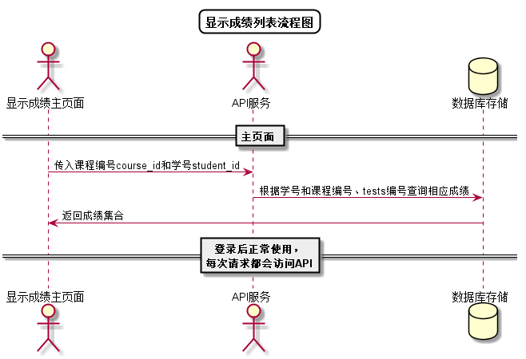

# “查看成绩及评价”用例 [返回](../../README.md)

## 1. 用例规约

|用例名称|查看成绩及评价|
|-------|:-------------|
|功能|学生/老师查看指定课程实验任务的信息|
|参与者|学生/老师|
|前置条件| 登录成功，能访问该课程|
|后置条件||
|主事件流| 1. 用户点击查看实验成绩及评价按钮 2.系统根据课程号以及学号查询并返回实验成绩信息 |
|备选事件流|1. 无课程考核则不显示信息  &nbsp;&nbsp; 2.老师尚未批改完成。|

## 2. 业务流程
    无

## 3. 界面设计
- 界面参照: https://zengyulong.github.io/is_analysis/test6/ui/学生登陆后主页.html
https://zengyulong.github.io/is_analysis/test6/ui/老师登陆后主页.html
- API接口调用
    - 接口：[getScores](../接口1/getScores.md)

## 4. 算法描述 [源码](../流程图/查看成绩及评价.wsd)

    
## 5. 参照表

- [COURSES](../数据库设计/数据库设计.md/#COURSES)