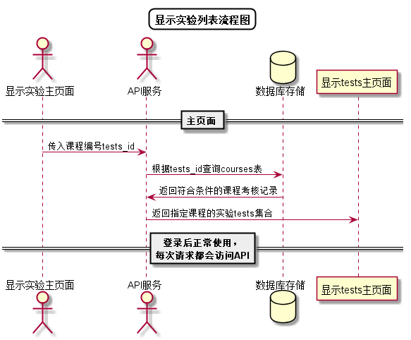

# “查看本课程实验任务”用例 [返回](../../README.md)

## 1. 用例规约

|用例名称|查看本课程实验任务|
|-------|:-------------|
|功能|学生/老师查看指定课程考核和要求|
|参与者|学生/老师|
|前置条件| 登录成功，能访问该课程|
|后置条件||
|主事件流| 1. 用户点击查看实验任务按钮 2.系统根据课程号查询并返回实验任务信息 |
|备选事件流|1.本课程暂无实验任务|

## 2. 业务流程
无

## 3. 界面设计
- 界面参照: 
https://zengyulong.github.io/is_analysis/test6/ui/学生登录后主页.html

https://zengyulong.github.io/is_analysis/test6/ui/老师登录后主页.html
- API接口调用
    - 接口：[getExperiments](../接口1/getExperiments.md)

## 4. 算法描述 [源码](../流程图/产看课程考核和要求.wsd)

    
## 5. 参照表

- [EXPERIMENTS](../数据库设计/数据库设计.md/#EXPERIMENTS)