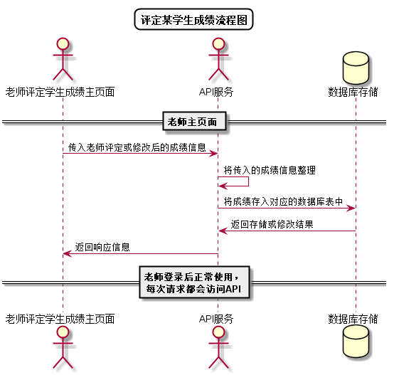

# “评定某学生成绩”用例 [返回](../README.md)

## 1. 用例规约

|用例名称|评定某学生成绩|
|-------|:-------------|
|功能|评定学生的课程成绩|
|参与者|老师|
|前置条件| 以老师的身份登录成功，能访问该课程|
|后置条件||
|主事件流| 1. 老师从学生列表中选择某个学生 2.系统显示学生成绩列表 3.老师输入成绩和评语并确认|
|备选事件流|1. 学生GitHub地址出错，无法评分  &nbsp;&nbsp; 2.系统提示成绩输入错误 |

## 2. 业务流程
无

## 3. 界面设计
- 界面参照: 
https://zengyulong.github.io/is_analysis/test6/ui/老师评定成绩.html

- API接口调用
    - 接口：[setScore](../接口1/setScore.md)

## 4. 算法描述 [源码](../流程图/评定学生成绩.wsd)

    
## 5. 参照表

- [STUDENTS](../数据库设计/数据库设计.md/#STUDENTS)
- [COURSES](../数据库设计/数据库设计.md/#COURSES)